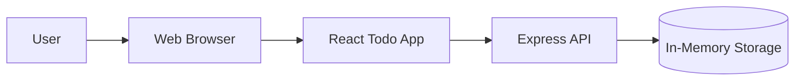
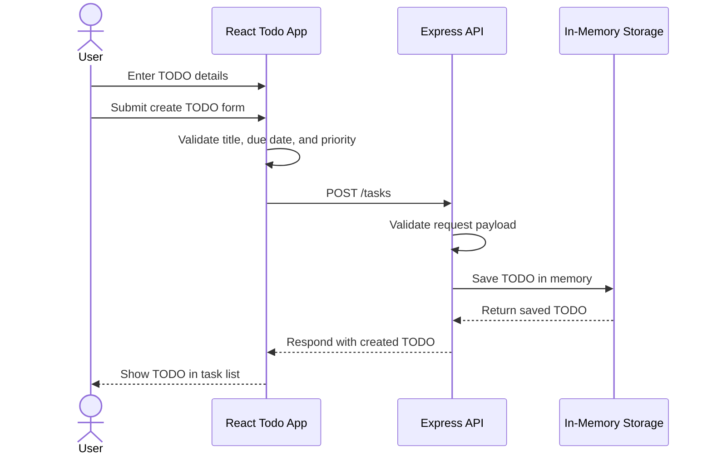

# Cloud Architecture Overview

## System Context

The Todo app is a JavaScript monorepo with a React frontend and a Node.js/Express API. The frontend sends task requests to the Express API, and the API stores task data in memory for the current runtime. No external database or cloud storage service is required for the current scope.

## Create TODO Sequence

## MVP Context

- Users interact with the Todo app through the React frontend.
- The React frontend communicates with the Express API for task operations.
- The Express API stores task data in memory.
- Due dates, priorities, filters, and validation are supported by the application flow.
- Data resets when the API process restarts because storage is in memory.
- No external storage, authentication, notifications, recurring jobs, or multi-user services are included.

## Deployment Context

- The frontend can be hosted as a static web application.
- The Express API can be deployed as a lightweight Node.js service.
- In-memory storage keeps the deployment simple but is not durable across restarts.